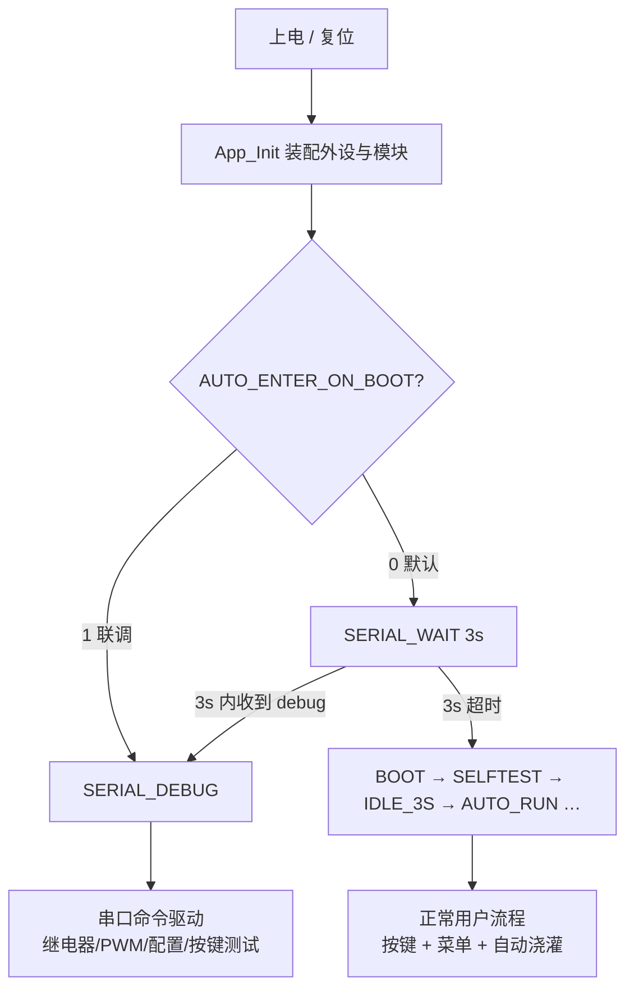
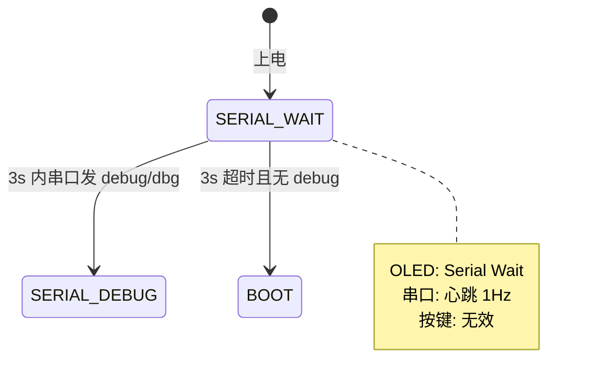
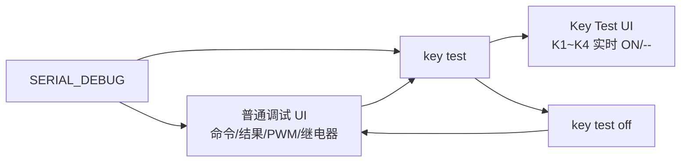
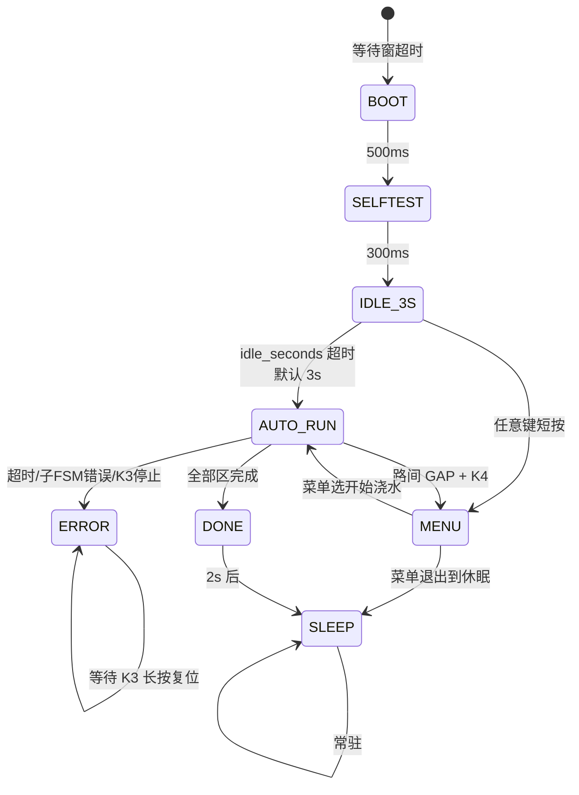
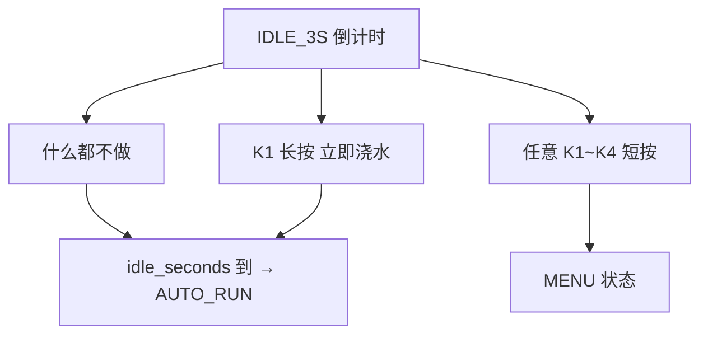

# FloraMate 上电运行分支与操作逻辑 V1.0

> 本文描述 **V1.0 固件** 从上电到关机/休眠的完整行为分支，涵盖串口调试、按键测试、正常浇灌流程与菜单。  
> 相关实现：`app_init.c`、`app_main_fsm.c`、`app_serial_debug.c`、`app_serial_debug_config.h`。

---

## 1. 总览：上电后两条主路径

上电后系统**不会立即浇水**，而是先经过「串口等待窗」或（编译选项）直接进入调试。只有超时且未进调试时，才走正常 `BOOT → … → AUTO_RUN` 流程。



| 编译宏 | 值 | 上电主状态 | 行为摘要 |
|--------|-----|------------|----------|
| `APP_SERIAL_DEBUG_AUTO_ENTER_ON_BOOT` | `0`（默认） | `SERIAL_WAIT` | 3s 内可发 `debug` 进调试；否则正常启动 |
| 同上 | `1` | `SERIAL_DEBUG` | 跳过等待窗与浇灌，常驻串口调试 |
| `APP_SERIAL_DEBUG_BOOT_WAIT_MS` | `3000` | — | 等待窗时长（ms） |

---

## 2. 上电初始化（所有路径共用）

`App_Init()` 顺序（`app_init.c`）：

1. **时基 + 日志 UART**：`Bsp_Tick_Init`、`Bsp_Usart_Log_Init`
2. **日志模块**：`App_Log_Init`，打印固件版本
3. **输出 Fail-Safe**：继电器全 OFF → PWM=0
4. **配置**：EEPROM → `App_Config_Init` → 应用按键阈值、OLED 对比度、日志等级
5. **HMI**：OLED、事件队列、按键回调 `App_Event_PostKey`
6. **应用**：菜单、显示、主 FSM、串口调试

主循环 `App_Loop()` 每轮固定顺序：

```
App_Log_Tick → USART TX Flush → App_SerialDebug_Tick
→ [若允许] Bsp_Key_Scan + 事件投递主 FSM
→ App_Main_Fsm_Tick → App_Display_Tick (100ms)
```

---

## 3. 分支 A：串口等待窗（SERIAL_WAIT）

### 3.1 进入条件

- `AUTO_ENTER_ON_BOOT = 0`
- 主 FSM 初始状态 = `SERIAL_WAIT`

### 3.2 并行行为

| 模块 | 行为 |
|------|------|
| 串口 | 每秒心跳：`hb uptime_ms=… wait_remain_ms=…` |
| OLED | `Serial Wait` 页，倒计时 `debug in Ns` |
| 按键 | **禁用**（`KeyInputEnabled = false`） |
| 主 FSM | 检测 `debug` 进入请求；或 3s 超时转 `BOOT` |

### 3.3 用户操作与转移



| 用户操作 | 串口响应 | 下一主状态 |
|----------|----------|------------|
| 发送 `debug` / `dbg` / `debug on` | `[I] ok: enter debug` | `SERIAL_DEBUG` |
| 无操作，等满 3s | `[I] serial wait: timeout…` | `BOOT` |
| 按 K1~K4 | 无（扫描未运行） | 仍 `SERIAL_WAIT` |

> `debug` 在等待窗内即可生效；进入 `SERIAL_DEBUG` 后 `App_SerialDebug_SetActive(true)`，此后命令无需再次 `debug`（除非复位）。

---

## 4. 分支 B：串口调试态（SERIAL_DEBUG）

### 4.1 进入条件（三选一）

1. 等待窗内发送 `debug`（最常见）
2. `AUTO_ENTER_ON_BOOT = 1` 上电即进入
3. 已在调试态再次发 `debug` → 提示 `already in debug`

### 4.2 本态特征

| 项目 | 说明 |
|------|------|
| 主 FSM | 停留在 `SERIAL_DEBUG`，**不**自动进入 `BOOT`/浇灌 |
| 按键（物理） | **默认禁用**，不投递菜单/停止事件 |
| 串口 | 解析命令；**无**等待窗心跳 |
| OLED | 默认 `Serial Debug` 页；`key test` 时切 `Key Test` 页 |
| 输出 | `valve`/`pump`/`stop` 等直接驱动 BSP（调试继电器无互锁） |

### 4.3 串口命令子分支



#### 4.3.1 普通调试界面

- 显示：`> 当前命令`、`OK:`/`ERR:`、PWM%、6 路继电器位
- 任意非 `key test` 类命令会结束按键测试（若曾进入）并刷新结果

常用命令见 `串口调试指令说明_V1.0.md`（`pump`、`valve`、`cfg`、`status`、`stop`、`reset` 等）。

#### 4.3.2 按键测试子模式（key test）

| 项目 | 说明 |
|------|------|
| 进入 | `key test` 或 `keytest` |
| 退出 | `key test off` / `key test exit` / `keytest off` |
| 扫描 | `App_SerialDebug_Tick` 内调用 `Bsp_Key_Scan()`（20ms 去抖） |
| OLED | 标题 `Key Test`；四行 K1 UP / K2 DOWN / K3 OK / K4 BACK |
| 串口 | 进入打印一次；**仅按键变化**时再打印 `keys k1=…` |
| 误操作 | 未在 key test 时发 `key test off` → `[E] err: not in key test` |

**注意**：退出 key test **不会**退出串口调试；主状态仍为 `SERIAL_DEBUG`，可继续 `valve`/`pump` 等。

#### 4.3.3 离开串口调试

当前 V1.0 **无** `debug off` 命令回到正常浇灌。要离开调试态需：

- `reset` → MCU 软件复位（重新走上电分支）；或
- 断电重上电，且 3s 内**不要**发 `debug`

---

## 5. 分支 C：正常启动与浇灌（无 debug）

### 5.1 主状态链



| 状态 | 时长/触发 | OLED 要点 | 按键 |
|------|-----------|-----------|------|
| `BOOT` | 500ms | Booting… | 无效 |
| `SELFTEST` | 300ms + 继电器脉冲自检 | Selftest | 无效 |
| `IDLE_3S` | 配置 `idle_seconds`（默认 3s） | 大数字倒计时 | **任意键短按 → 菜单**；K1 长按可跳过进 AUTO |
| `AUTO_RUN` | 直至全部区完成或错误 | 当前区/进度 | K3 停止；路间 GAP 时 K4 进菜单 |
| `MENU` | 用户操作 | 菜单各子页 | K1~K4 完整映射 |
| `DONE` | 2s 后 → SLEEP | Task complete | — |
| `SLEEP` | 永久 | 等待下次上电 | K3 长按可复位（与 ERROR 类似） |
| `ERROR` | 永久至复位 | 错误码 + 输出已关 | K3 长按 → NVIC 复位 |

### 5.2 IDLE_3S：用户可做的选择



### 5.3 AUTO_RUN 内部（子 FSM 简述）

对 `channel_enable` 中使能的 Z1~Z4 **顺序**执行水泵子状态机：

`OPEN_MAIN → STEP(多档占空) → RAMP_DOWN → CLOSE_MAIN → CLOSE_VALVE → GAP → 下一路`

- **总超时**：`total_timeout_s`（默认 480s）→ `ERROR`
- **单路超时**：子 FSM → `ERROR`
- **K3**：中止当前任务 → 关输出 → `ERROR` 或 `DONE`（实现以 `app_main_fsm.c` 为准）

### 5.4 菜单（MENU）分支

从 `IDLE_3S` 或 `AUTO_RUN`（路间 GAP）进入。典型子页：

| 子页 | 作用 |
|------|------|
| Main | 进入参数 / 手动测试 / 信息 / 出厂复位 |
| Params | 改配置字段；K3 长按保存 |
| Manual | 手动继电器/PWM 测试 |
| Info | 版本、配置来源 |
| Factory Reset | K4 长按 3s 确认 |

退出菜单可回到 `AUTO_RUN` 或 `SLEEP`（取决于菜单选择，见 `App_Menu` 与 `app_main_fsm.c`）。

---

## 6. 按键输入使能矩阵

| 主状态 | `Bsp_Key_Scan` | 事件进主 FSM | 串口 key test 扫描 |
|--------|----------------|--------------|-------------------|
| `SERIAL_WAIT` | 否 | 否 | 否 |
| `SERIAL_DEBUG` | 否* | 否 | **仅** `key test` 激活时由 `App_SerialDebug_Tick` 扫描 |
| `BOOT` ~ `SLEEP`（非调试） | 是 | 是 | 否 |

\*调试态下物理按键不参与菜单/停止逻辑，避免误触。

---

## 7. 显示（OLED）与刷新

| 主状态 | 页面 | 刷新策略 |
|--------|------|----------|
| `SERIAL_WAIT` | Serial Wait | 强制 ~100ms |
| `SERIAL_DEBUG` | Serial Debug / Key Test | 强制 ~100ms |
| 其它 | 各状态对应 Draw_* | 100ms 或 `MarkDirty` |

串口调试态**无**固件自动息屏；若屏幕变黑，多为 I²C/供电问题（见前期说明），非设计内的 30s 关屏。

---

## 8. 典型场景速查

### 场景 1：生产联调（只要串口）

1. 编译 `AUTO_ENTER_ON_BOOT=1` 或上电 3s 内发 `debug`
2. `valve open 1`、`pump 30`、`status` …
3. `key test` 检查四键 → `key test off`
4. `reset` 或断电结束

### 场景 2：用户正常浇水

1. 上电，**不要**发 `debug`
2. 等自检 + IDLE 倒计时（或按键进菜单改参数）
3. 自动进入 `AUTO_RUN` 按配置浇水
4. 完成 → `DONE` → `SLEEP`，等待插座断电

### 场景 3：运行中进菜单

1. 已在 `AUTO_RUN`
2. 等待**路间 GAP**（两路之间静默期）
3. 按 **K4** 进入 `MENU`
4. 改参数 / 手动测试 / 退出

### 场景 4：异常

- 超时或 K3 停止 → `ERROR`，继电器与 PWM 强制关闭
- OLED 显示错误码；**K3 长按** 软件复位

---

## 9. 串口调试命令与 UI 状态（补充）

| 命令 | UI 状态 | 说明 |
|------|---------|------|
| （刚进入 debug） | `IDLE` | Cmd: (idle) |
| 普通命令执行中 | `RUNNING` → `OK`/`ERR` | 显示结果行 |
| `key test` | `KEY_TEST` | 专用四键页 |
| `key test off` | `OK` + 文案 key test off | 回 Serial Debug 默认布局 |
| 其它命令（在 key test 中） | 先退出 key test，再执行 | `Ui_SetRunning` 会 `KeyTest_Stop()` |

---

## 10. 文档与代码索引

| 主题 | 文件 |
|------|------|
| 串口命令列表 | `doc/串口调试指令说明_V1.0.md` |
| 调试配置宏 | `code/App/serial_debug/app_serial_debug_config.h` |
| 命令解析 | `code/App/serial_debug/app_serial_debug.c` |
| 主状态机 | `code/App/main_fsm/app_main_fsm.c` |
| 显示 | `code/App/display/app_display.c` |
| 主循环 | `code/App/init/app_init.c` |

---

## 修订记录

| 版本 | 日期 | 说明 |
|------|------|------|
| V1.0 | 2026-05-16 | 首版：含串口等待窗、调试态、key test 进入/退出、正常浇灌与菜单分支 |
