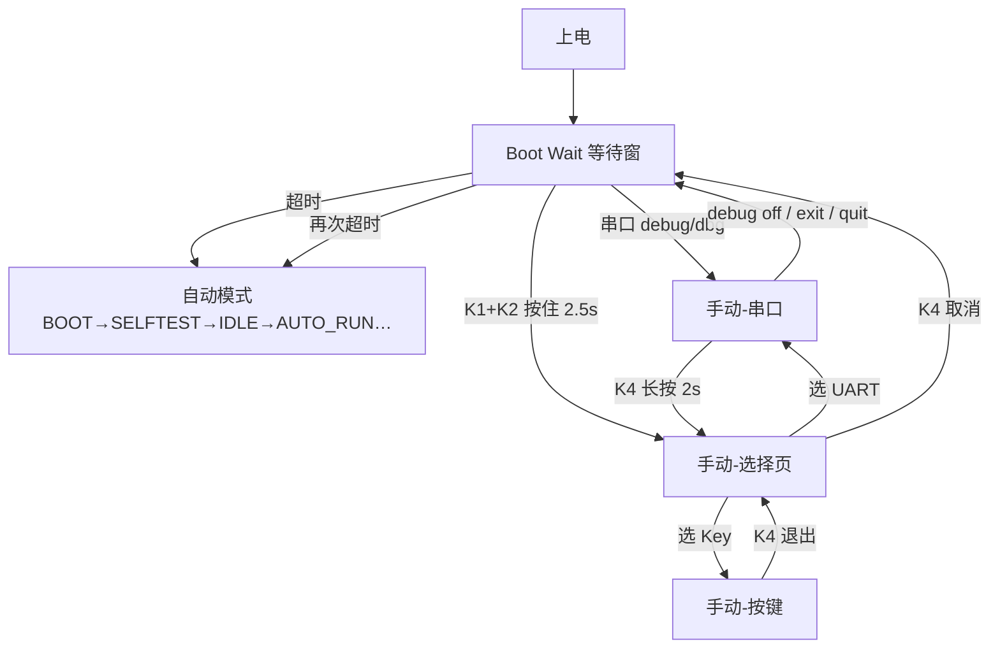

# FloraMate 上电运行分支与操作逻辑 V1.1

> V1.1 在 V1.0 基础上增加 **自动 / 手动** 双架构、K1+K2 进手动、手动子模式选择、串口退出回等待窗、按键手动控制。  
> **硬件（V1.0.3）**：1.3 寸 OLED；独立按键（按下低电平）；继电器 **CH1=水泵总电源，CH2~CH5=阀，CH6=备用**（与 `bsp_relay.h`、串口 `valve` 编号一致）。

---

## 0. 四键统一约定（全页面）

| 按键 | 功能 |
|------|------|
| **K1** | 向下移动光标 / **增加**数值 |
| **K2** | 向上移动光标 / **减少**数值 |
| **K3** | **确定** / 进入 / 切换当前项 |
| **K4** | **退出** / 返回上一级 |

例外（非菜单页）：

- **Boot Wait**：按下 `K1` 或 `K2` 会先暂停自动倒计时；`K1+K2` 同时按住 2.5s → 进手动选择（非 K3/K4）。
- **串口手动**：命令行为不变；`K4` 长按 2s 返回 Manual 选择页（见串口说明）。

OLED 布局：第 0 行反白标题栏 + 底部分隔线；正文从第 2 行起，避免与标题重叠；多数页面底行显示 `K1v K2^ K3:OK K4:Exit`。

---

## 1. 顶层架构



| 模式 | 说明 | 主状态 |
|------|------|--------|
| **等待窗** | 上电后 `APP_SERIAL_DEBUG_BOOT_WAIT_MS`（默认 **10s**） | `SERIAL_WAIT` |
| **自动** | 原浇灌流程 | `BOOT` … `SLEEP` |
| **手动-选择** | 选串口或按键控制 | `MANUAL_SELECT` |
| **手动-串口** | 原串口调试命令 | `SERIAL_DEBUG` |
| **手动-按键** | 按键控阀/PWM | `MANUAL_KEY` |

---

## 2. Boot Wait（上电等待窗）

### 2.1 并行行为

- OLED：**Boot Wait**，`Auto in Ns` 倒计时；提示 `UART: debug`；按下 `K1/K2` 暂停倒计时，`K1+K2` 同时按住时显示进入手动进度。
- 串口：每秒心跳（未进手动串口时）。
- 按键：仅用于 **K1+K2 组合检测**（`BootWait_Tick_Combo` 内 `Bsp_Key_Scan`），不投递菜单事件。

### 2.2 三条出口

| 用户操作 | 结果 |
|----------|------|
| 无操作，倒计时结束 | → `BOOT`（自动流程） |
| 发送 `debug` / `dbg` | → `SERIAL_DEBUG`（手动串口，跳过选择页） |
| **K1+K2 同时按住 ≥ 2.5s** | → `MANUAL_SELECT` |

宏：`APP_MODE_MANUAL_COMBO_HOLD_MS`（默认 **2500** ms）。

---

## 3. 手动-选择（MANUAL_SELECT）

OLED 列表：

1. **UART Command** — 进入串口手动（等同 `debug`）
2. **Key Control** — 进入按键手动
3. **Return Boot** — 回到上电 **Boot Wait**（10s 倒计时）

| 按键 | 功能 |
|------|------|
| K1 | 光标下移 |
| K2 | 光标上移 |
| K3 | 确认当前项 |
| K4 | 退出 → **Boot Wait** |

等待窗内若收到 `debug`，也可直接进入 `SERIAL_DEBUG`（不必先进选择页）。

---

## 4. 手动-串口（SERIAL_DEBUG）

与此前串口调试一致：`pump`、`valve`、`cfg`、`key test`、`stop`、`reset` 等。

### 4.1 退出回等待窗

| 命令 | 作用 |
|------|------|
| `debug off` | 退出手动串口 |
| `exit` / `quit` | 同上 |
| `manual exit` | 同上 |

效果：

1. 关闭串口调试激活态，关输出（继电器+PWM）
2. `App_Main_Fsm_EnterBootWait()` → **Boot Wait**
3. 若等待窗内无新手动指令 → 超时后进入 **自动浇灌**

### 4.2 key test 子模式

- `key test` / `keytest`：OLED 显示四键状态
- `key test off`：退出 key test，仍留在串口手动

---

## 5. 手动-按键（MANUAL_KEY）

无互锁，使用 `Bsp_Relay_DebugSet`；适合板级联调。

### 5.1 控制对象（光标 7 项，OLED 双列）

| 光标 | OLED | 继电器 |
|------|------|--------|
| 0 | Pwr | CH1 水泵总电源 |
| 1~4 | V1~V4 | CH2~CH5 电磁阀 |
| 5 | Rsv | CH6 备用 |
| 6 | Pump | PWM |

### 5.2 按键映射

| 按键 | 功能 |
|------|------|
| K1 | 光标下移；**已进入 Pump 编辑** 时 +5% |
| K2 | 光标上移；**已进入 Pump 编辑** 时 -5% |
| K3 | 继电器切换；Pump 项首次 **进入编辑**，再次 K3 开/关（0↔30%） |
| K4 | 关闭全部输出并退出 → **Boot Wait** |

---

## 6. 自动模式（简述）

与 V1.0 相同：

`BOOT(500ms) → SELFTEST → IDLE_3S(默认3s) → AUTO_RUN → DONE → SLEEP`

- `IDLE_3S`：任意键短按进 **MENU**；K1 长按直接浇水
- `AUTO_RUN`：**K3 停止** → 进入 **MANUAL_SELECT**（不再进 DONE）；路间 GAP 时 K4 进菜单
- `ERROR`：K3 长按复位

---

## 7. 按键输入使能

| 主状态 | 主循环 KeyScan+事件 |
|--------|---------------------|
| `SERIAL_WAIT` | 否（仅 FSM 内组合键扫描） |
| `SERIAL_DEBUG` | 否（`key test` 时由串口模块扫描） |
| `MANUAL_SELECT` / `MANUAL_KEY` | **是** |
| `IDLE_3S` / `AUTO_RUN` / `MENU` / 终态 | 是 |

---

## 8. 典型场景

### 生产：串口联调

```
上电 → 3s 内 debug → valve/pump … → debug off → 等 3s → 自动自检浇水（或断电）
```

### 生产：按键联调

```
上电 → 按住 K1+K2 2.5s → 选 Key Control → K3 进入选项后控制 Z1/C5/Pump → K4 退出选项/返回选择页
```

### 用户正常使用

```
上电 → 不按键、不发 debug → 3s 后自动 BOOT → … → AUTO_RUN
```

---

## 9. 配置宏

文件：`app_serial_debug_config.h`

| 宏 | 默认 | 含义 |
|----|------|------|
| `APP_SERIAL_DEBUG_BOOT_WAIT_MS` | **10000** | 等待窗时长 |
| `APP_MODE_MANUAL_COMBO_HOLD_MS` | **2500** | K1+K2 进入手动所需时长 |
| `APP_SERIAL_DEBUG_AUTO_ENTER_ON_BOOT` | 0 | 1=上电直接进串口手动 |

---

## 10. 代码索引

| 模块 | 路径 |
|------|------|
| 主状态机 | `App/main_fsm/app_main_fsm.c` |
| 手动选择 | `App/manual_select/app_manual_select.c` |
| 按键手动 | `App/manual_key/app_manual_key.c` |
| 串口手动 | `App/serial_debug/app_serial_debug.c` |
| 显示 | `App/display/app_display.c` |

---

## 修订记录

| 版本 | 日期 | 说明 |
|------|------|------|
| V1.0 | 2026-05-16 | 串口等待、调试、key test |
| V1.1 | 2026-05-16 | 自动/手动架构、K1+K2、选择页、串口退出、按键手动 |
