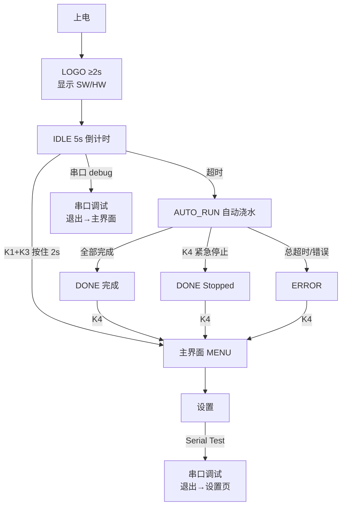

# FloraMate 上电运行分支与操作逻辑 V2.0

> **HMI V2.0 产品路径**（2026-09-10 实现并手测通过）。  
> 完整页面与按键表见 [`屏幕与按键交互设计_V2.0.md`](屏幕与按键交互设计_V2.0.md)。  
> 旧版 V1.1（Boot Wait 10s + K1+K2 手动）已废弃。

| 项目 | 内容 |
|------|------|
| 文档版本 | V2.0 |
| 日期 | 2026-09-10 |
| 硬件 | Top 板 V2.0：K1~K4 = **PC0~PC3**；阀 Z1~Z5 = PA1~PA5；泵 PWM = PA0 |

---

## 1. 四键统一约定

| 按键 | 功能 |
|------|------|
| **K1** | 向下移动光标 / **增加**数值 |
| **K2** | 向上移动光标 / **减少**数值 |
| **K3** | **确定** / 进入 / 切换 / 单项保存（参数页） |
| **K4** | **退出** / 返回上一级 |

例外见各页 OLED 底行提示。多数列表页底行：`K1v K2^ K3OK K4Esc`。

**组合键（仅 Idle）：** K1 + K3 同时按住 **2s** → 进入**主界面**（防误触门槛）。

---

## 2. 顶层流程



**Logo：** 至少 2s；EEPROM 读取失败时额外 +2s，版本行显示 `0.0` 与 `CFG LOAD FAIL`，仍加载出厂默认并进入 Idle。

**Idle：** 固定 **5s**（不复用配置项 `idle_seconds`）。按住 K1+K3 期间倒计时**暂停**。

**产品路径不做阀自检短脉冲**；自检放在「设置 → 本地测试」。

---

## 3. 菜单树

```
主界面 (MAIN)
├── 1. Auto Water      → 启动自动浇水 → AUTO_RUN
└── 2. Settings
    ├── Params         → 参数列表（K3 单项写 EEPROM）
    ├── Local Test
    │   ├── Screen     → 全屏测试图案
    │   ├── Key        → 按键测试（5s 无操作返回）
    │   └── Water      → 供水测试（可多路同时开；离开关阀停泵）
    └── Serial Test    → 串口调试
```

主界面 **K4 忽略**（无上一级）。

---

## 4. 建议手测清单

1. **上电默认路径：** Logo 版本行 → Idle `5…1` → 自动浇水 → 完成页 → **K4** 回主界面  
2. **进菜单：** 上电 Idle 期间 **K1+K3 按住 2s** → 主界面 → Settings → Local Test → Key  
3. **参数持久化：** Settings → Params → 改 `contrast` → **K3** 保存 → 断电重启验证  
4. **紧急停止：** 自动浇水中 **K4** → `STOPPED` → **K4** 回主界面  
5. **产线串口：** Idle 期间发 `debug` → 串口可用；`debug off` 或 **K4 长按 2s** → **主界面**  
6. **设置内串口：** Settings → Serial Test → 退出 → **回到设置页**（非主界面）

---

## 5. 与串口调试的关系

| 入口 | 退出后落点 |
|------|------------|
| Idle 期间发 `debug` / `dbg` | **主界面** |
| 设置 → Serial Test | **设置页** |
| `APP_SERIAL_DEBUG_AUTO_ENTER_ON_BOOT=1` | 上电直进串口（联调用） |

命令字与参数见 [`串口调试指令说明_V1.0.md`](串口调试指令说明_V1.0.md)（§2 已按 V2.0 更新）。

---

## 修订记录

| 版本 | 日期 | 说明 |
|------|------|------|
| V2.0 | 2026-09-10 | 首版：Logo/Idle/主界面产品路径；替代 V1.1 |
